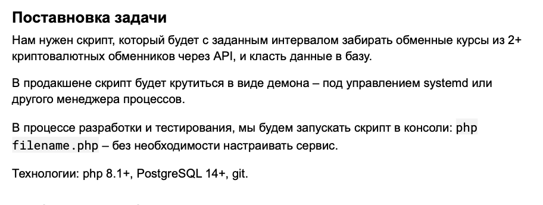
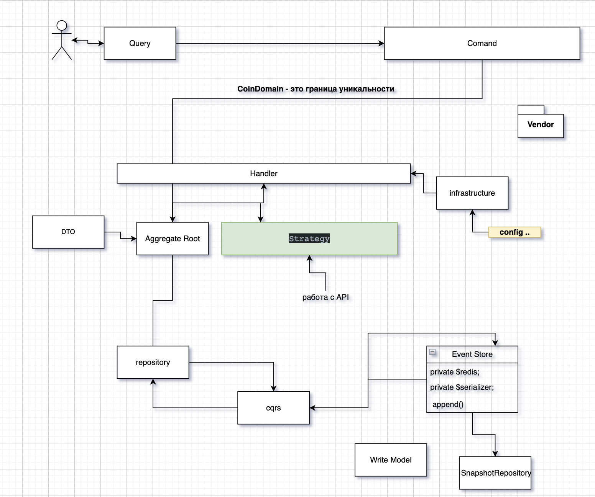
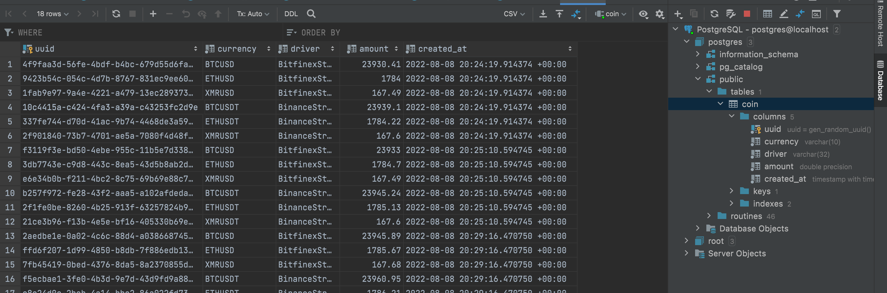

**Задача**

**Документация**

    composer install  - установит пакеты

    docker-compose up -  установит PostgreSQL

    src/CoinDomain/Infrastructure/Config/config.ini - наш конфиг с выбором драйвера

    src/CoinDomain/Infrastructure/Db/DbConfig.php - подключение  к базе

    make currency - запустить команду по скачиванию 

**Блок схема**

**Пример работы**

